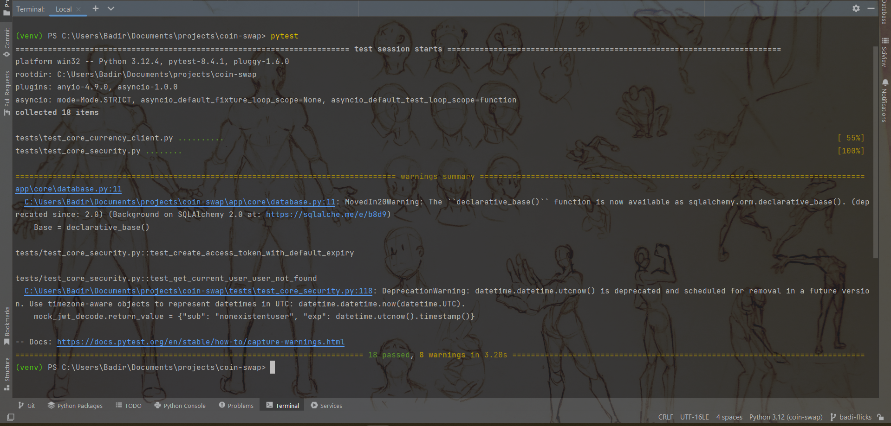
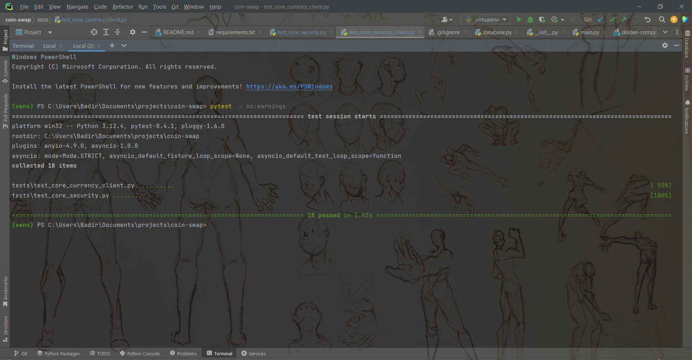
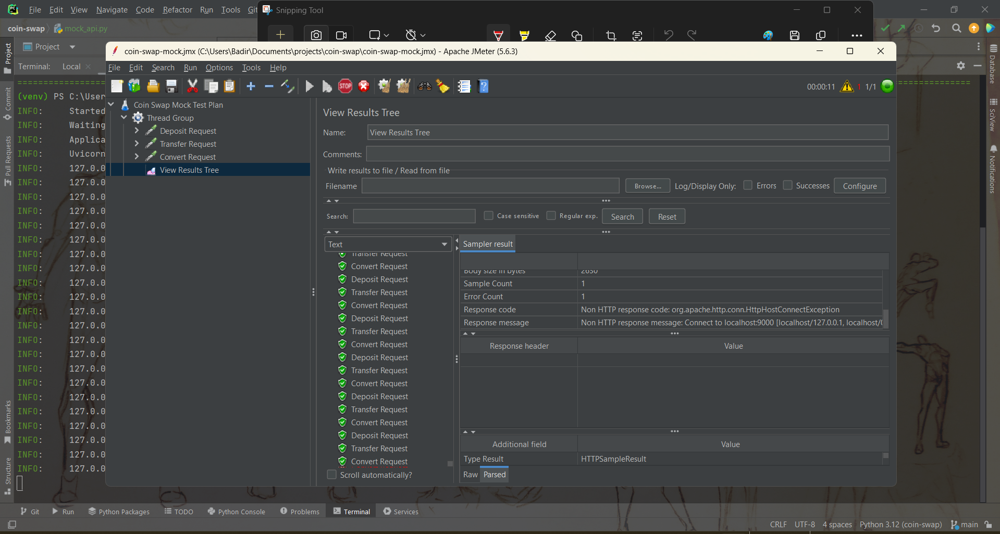

# Proyecto Coin Swap

Proyecto backend con FastAPI para simulación de conversión y transferencia de monedas entre usuarios, usando PostgreSQL y MongoDB.

---

## Características

- Registro y autenticación de usuarios sin contraseña (solo por nombre de usuario).
- Transferencias entre usuarios en las monedas PEN y USD.
- Conversión de monedas (PEN ↔ USD).
- Gestión de saldos con operaciones de depósito y retiro.
- Historial de transacciones.
- Soporte para múltiples proveedores de tasas de cambio.

---

## Requisitos

- **Python 3.9+**
- **PostgreSQL** para la base de datos.
- **MongoDB** para el almacenamiento de las transacciones.
- **Docker** (opcional, para facilitar la configuración de las bases de datos).

---

## Configuración y ejecución

1. Clonar el repositorio:

```bash
git clone https://github.com/bianca-ap01/coin-swap.git
cd coin-swap
```

2. Crear y activar entorno virtual:

En la raíz del proyecto, crea un entorno virtual:
```bash
python3 -m venv venv
source venv/bin/activate  # Linux/macOS
# o en Windows
venv\Scripts\activate
```

3. Instalar dependencias:

Con el entorno virtual activo, instala las dependencias:

```bash
pip install -r requirements.txt
```

4. Levantar bases de datos con Docker Compose (Opcional):

```bash
docker-compose up -d
```
Esto levantará dos contenedores:

- PostgreSQL en el puerto 5432.

- MongoDB en el puerto 27017.


5. Crear las tablas en la base de datos:

Para crear las tablas de la base de datos, ejecuta el siguiente comando:

```bash
uvicorn app.main:app --reload
```

Esto iniciará FastAPI y ejecutará las migraciones automáticamente.

Cuando inicies la aplicación, se crearán automáticamente dos usuarios en la base de datos con los saldos predefinidos:

- Usuario X: `S/. 100`, `USD 200`

- Usuario Y: `S/. 50`, `USD 100`

6. Visualizar la aplicación

Ingresar a la carpeta `frontend` 

```bash
cd frontend/
```

Abrir en el navegador el archivo `index.html`

```bash
xdg-open index.html # Linux/maxOS
start index.html # Windows
```

---

## Configuración y ejecución

1. Registrar un nuevo usuario

POST `/auth/register/`

**Body (JSON):**
```json
{
  "username": "nuevo_usuario"
}
```

2. Obtener token de acceso (login)

POST `/auth/token/`

**Body (x-www-form-urlencoded):**
```bash
username=nuevo_usuario
password=
```

3. Consultar el saldo de un usuario 

GET `/users/me/balance/`

**Headers:**
```bash
Authorization: Bearer <token>
```

4. Realizar una transferencia

POST `/transfer/transfer/`

**Body (JSON):**
```json
{
  "receiver": "usuario_receptor",
  "amount": 50.0,
  "currency": "USD"
}
```

**Headers:**
```bash
Authorization: Bearer <token>
```

5. Convertir monedas (PEN ↔ USD)
POST `/transfer/convert/`

**Body (JSON):**
```json
{
  "from_currency": "USD",
  "to_currency": "PEN",
  "amount": 50.0
}
```

**Headers:**
```bash
Authorization: Bearer <token>
```

6. Depósito o Retiro de saldo
POST `/transfer/user/balance/change/`

El parámetro `operation` puede tomar los valores `deposit` (para ingresar dinero a la cuenta) o `withdraw` (para retirar dinero de la cuenta)

**Body (JSON):**
```json
{
  "amount": 50.0,
  "currency": "USD",
  "operation": "deposit"
}
```

**Headers:**
```bash
Authorization: Bearer <token>
```

7. Ver historial de transacciones
GET `/transactions/`

**Headers:**
```bash
Authorization: Bearer <token>
```

---

## Patrones de diseño

1. Singleton

El patrón Singleton se utiliza en la clase `CurrencyAPIClientSingleton` para garantizar que solo haya una instancia del cliente de API de tasas de cambio. Esto es útil porque solo se necesita una instancia para gestionar la conexión a las APIs externas, evitando la creación de múltiples objetos innecesarios.

2. Adapter

El patrón Adapter se utiliza para integrar varias fuentes de tasas de cambio de manera flexible. Se crean diferentes adaptadores para interactuar con distintas APIs de tasas de cambio (por ejemplo, `ExchangeRateHostAdapter`, `ExchangeRatesAPIAdapter`). De esta manera, el sistema puede intercambiar fácilmente entre proveedores de tasas sin modificar el código base.

---

## Estructura del repositorio

```bash
coin-swap/
├── app/                        # Código principal de la aplicación
│   ├── __init__.py             # Marca la carpeta como un módulo
│   ├── main.py                 # Archivo principal que inicia la app FastAPI
│   ├── api/                    # Rutas de la API
│   │   ├── __init__.py
│   │   ├── routes/             # Endpoints de la API (autenticación, usuarios, transferencias, etc.)
│   │   ├── auth.py
│   │   ├── users.py
│   │   ├── transfer.py
│   │   └── transactions.py
│   ├── core/                   # Lógica central de la app y configuraciones
│   │   ├── __init__.py
│   │   ├── currency_client.py  # Adaptadores y cliente de la API para tasas de cambio
│   │   ├── database.py         # Configuración de la base de datos
│   │   └── security.py         # Seguridad y autenticación de usuarios
│   ├── models/                 # Definición de los modelos de la base de datos
│   │   ├── __init__.py
│   │   ├── user.py             # Modelo de usuario
│   │   ├── transaction.py      # Modelo de transacciones
│   │   └── transfer.py         # Modelo para transferencias y conversiones
│   └── crud/                   # Operaciones CRUD para interactuar con la base de datos
│       ├── __init__.py
│       ├── user.py             # CRUD de usuarios
│       ├── transaction.py      # CRUD de transacciones
│       └── transfer.py         # CRUD de transferencias
├── frontend/                   # Frontend del proyecto
│   └── index.html              # Archivo principar para 
├── .gitignore                  # Archivos a excluir del control de versiones
├── requirements.txt            # Dependencias del proyecto
├── docker-compose.yml          # Configuración de contenedores Docker
└── README.md                   # Documentación del proyecto
```
# EC4 - Pruebas Unitarias y Performance API Monedas

## Grupo e Integrantes

- Bianca Aguinaga  
- Zamir Lizardo  
- Jorge Melgarejo  
- Ariana Mercado  
- Matías Meneses  
- Badi Rodríguez  

---

## Pruebas Unitarias

- Realizadas con `PyTest` o `UnitTest`.
- Reporte de Code Coverage: **100% en servicios** (excluye routers/controladores).
- Pruebas enfocadas exclusivamente en **métodos o servicios**, **no en endpoints**.

### Buenas prácticas

- Mocks de `httpx.AsyncClient`, JWT y BD.
- Verificación de excepciones con `pytest.raises`.
- Asserts de interacción: `await_count`, `assert_called_once_with`.

---

## Stack de Test

| Herramienta         | Uso                                                        |
|---------------------|------------------------------------------------------------|
| PyTest              | Framework de testing síncrono y asíncrono                 |
| unittest.mock       | Aislamiento de dependencias (HTTP, BD, JWT, etc.)         |
| pytest-asyncio      | Soporte para coroutines en pruebas `async`                |

---

## Cobertura Alcanzada

| Módulo                      | Líneas | Cubiertas | %     |
|----------------------------|--------|-----------|-------|
| `currency_client.py`       | 185    | 185       | 100%  |
| `security.py`              | 142    | 142       | 100%  |
| **TOTAL servicios**        | **327**| **327**   |**100%**|





---

## Resumen de Casos por Archivo

| Archivo                        | Casos clave cubiertos                                                                 |
|-------------------------------|----------------------------------------------------------------------------------------|
| `test_core_currency_client.py`| Éxitos y errores en API; Singleton; cambio de adaptador dinámico                      |
| `test_core_security.py`       | JWT con expiración; payload extendido; flujo `get_current_user` y errores relacionados|


---

## Autenticación y Seguridad

- Pruebas para tokens JWT válidos, expirados e inválidos.
- Control total sobre las dependencias `Depends` de FastAPI para evitar problemas de inyección.

---

## Estructura de Archivos de Test

Organización por módulo:

```
test_core_currency_client.py
test_core_security.py
```

---

## Pruebas de Performance

- Herramienta sugerida: **JMeter** (o similar).
- No usar API real → usar **mock** o **modo caché** que simule un delay de **500ms**.

### Escenario propuesto

1. Depósito y transferencia.
2. Transferencias de ida y vuelta entre monedas distintas.
3. Validar que el estado final de la BD sea **consistente** (saldos coherentes).

---

## Entregables

- Archivo `.jmx` u equivalente.
- Capturas de pantalla como evidencia.
- Informe y código disponible en el repositorio:




🔗 [Repositorio en GitHub](https://github.com/bianca-ap01/coin-swap)

🔗 [Rama: badi-flicks (Performance)](https://github.com/bianca-ap01/coin-swap/tree/badi-flicks)


